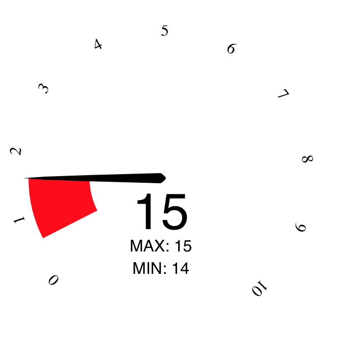

# D3 gauge

A simple gauge that uses d3.

You can have maximum and minimum values stored in this gauge.

The gauge can autoscale.

To see the gauge in action, download the repo, npm install, then run it locally with webpack to see what it looks like.

## Example gauge



## Example code

Here is an example code snippet:

```javascript
var gauge = new Gauge('#idOfSelectedElement', {
    size: 300,
    clipWidth: 300,
    clipHeight: 300,
    ringWidth: 60,
    maxValue: 10,
    transitionMs: 4000
});
gauge.render();
```

## Full range of config settings

```javascript
{
            size: 200,
            clipWidth: 200,
            clipHeight: 110,
            ringInset: 20,
            ringWidth: 20,

            pointerWidth: 10,
            pointerTailLength: 5,
            pointerHeadLengthPercent: 0.9,

            minValue: 0,
            maxValue: 10,

            minAngle: -90 - 45,
            maxAngle: 90 + 45,

            transitionMs: 750,

            majorTicks: 10,
            labelFormat: d3.format(',g'),
            labelInset: 10,
            // sets whether values when they overflow from maximum should be
            // snapped back to maximum or go back around from the start
            isCyclic: false,

            arcColorFn: d3.interpolateHsl(d3.rgb('#e8e2ca'), d3.rgb('#3e6c0a'))
}
```
